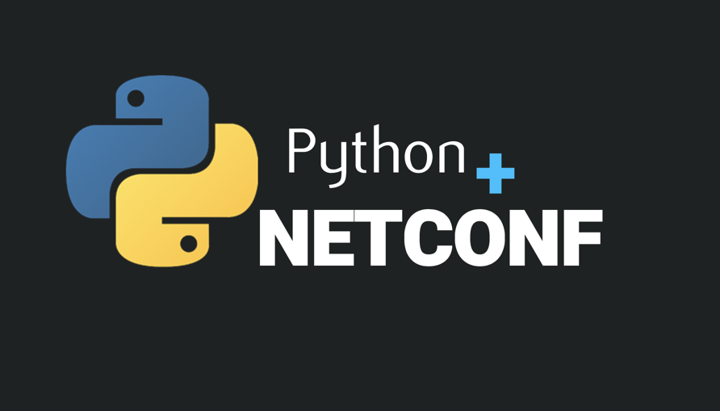
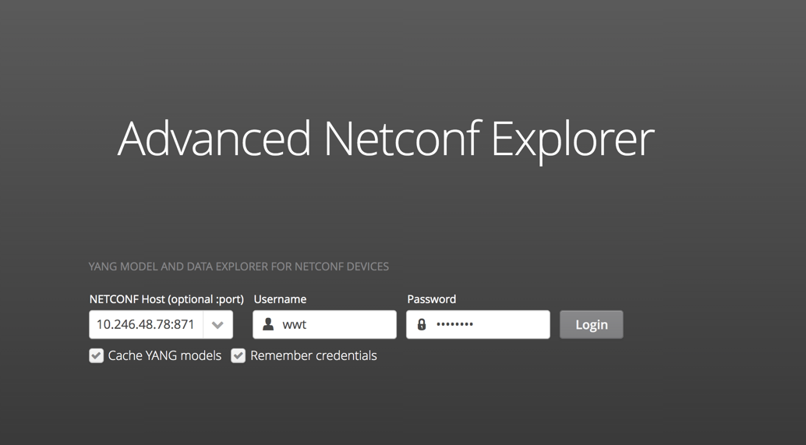
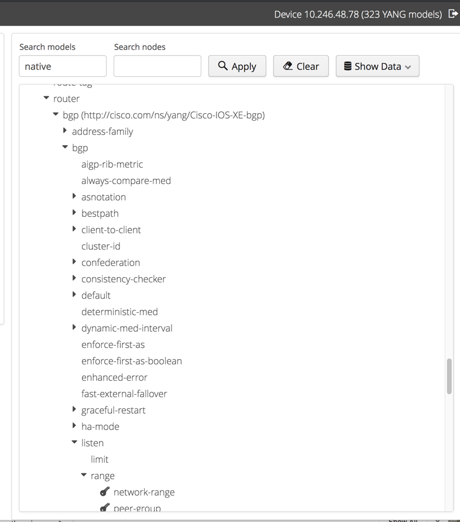

## 1. Enable `netconf-yang` on IOS XE

#### :keyboard: Connect to NETCONF server

```sh
ssh wwt@10.246.48.75 -p <ssh-port>
```

#### Authentication

Enabling authentication with privilege level 15 access is required for NETCONF. See [Documentation]() for more details. The proper access is already configured for this lab.

#### :keyboard: Verify that the process is disabled

```sh
R1# show platform software yang-management process
confd            : Not Running
nesd             : Not Running
syncfd           : Not Running
ncsshd           : Not Running
dmiauthd         : Not Running
nginx            : Running
ndbmand          : Not Running
pubd             : Running
```

#### :keyboard: Enable `netconf-yang` process on the router

```sh
R1# configure terminal
R1(config)# netconf-yang
%PSD_MOD-5-DMI_NOTIFY_NETCONF_START: R0/0: psd: PSD/DMI: netconf-yang server has been notified to start
```

#### :keyboard: Verify the process again (takes about a minute)

```sh
R1#show platform software yang-management process
confd            : Running
nesd             : Running
syncfd           : Running
ncsshd           : Running
dmiauthd         : Running
nginx            : Running
ndbmand          : Running
pubd             : Running
```


## 2. Hello World!

As a reminder, the **NETCONF** messages layer provides a simple, **transport-independent** framing mechanism for encoding rpc messages and notifications. SSH and TLS are the most common protocols used to provide a secure transport layer for NETCONF.

#### :keyboard: Connect to NETCONF server using SSH and `netconf` subsystem

A simple, but unpractical, exercise is to connect to the NETCONF server using `netconf` subsystem for SSH to interact with the NETCONF server.

```sh
$ ssh wwt@10.246.48.75 -p <netconf-port> -s netconf
```

You should see an output similar to the following, which displays the advertised capabilities from the server (router).

```sh
<?xml version="1.0" encoding="UTF-8"?>
<hello xmlns="urn:ietf:params:xml:ns:netconf:base:1.0">
<capabilities>
<capability>urn:ietf:params:netconf:base:1.0</capability>
<capability>urn:ietf:params:netconf:base:1.1</capability>
<capability>urn:ietf:params:netconf:capability:writable-running:1.0</capability>
<capability>urn:ietf:params:netconf:capability:xpath:1.0</capability>
<capability>urn:ietf:params:netconf:capability:validate:1.0</capability>
<capability>urn:ietf:params:netconf:capability:validate:1.1</capability>
<capability>urn:ietf:params:netconf:capability:rollback-on-error:1.0</capability>
<capability>urn:ietf:params:netconf:capability:notification:1.0</capability>
<capability>urn:ietf:params:netconf:capability:interleave:1.0</capability>

<OUTPUT OMITTED>

<capability>
        urn:ietf:params:netconf:capability:notification:1.1
      </capability>
</capabilities>
<session-id>31</session-id></hello>]]>]]>

```


If you press `Enter` or `Return` on your keyboard a few times,  you'll notice that this session does not behave as a normal SSH session to a device CLI. There's nothing wrong. The server is simply waiting for an `rpc` message to process.

#### :keyboard: Disconnect from the session

From the output in the previous activity, you can see that the session ID for the connection that was established is `30`. We can craft an `rpc` message to kill the session as shown below.

```sh
<rpc>
<kill-session>
<session-id>30</session-id>
</kill-session>
</rpc>
]]>]]>
```

This will disconnect your session and return you to your terminal.


## 3. NETCONF + Python



It is far more useful to use NETCONF to configure YANG data using python than connecting directly with SSH. To interact with YANG modules using Python, we'll use a NETCONF client for Python called `ncclient`.

### What you'll build

* A simple hub and spoke network with BGP
* Python helper scripts to simplify  NETCONF configuration

### You'll need

* Docker Desktop - You can get the right version for your OS  [HERE]().

### Getting Started

Before we can use YANG modules to configure a device, it is useful to first learn how they're structured. We'll use the Advanced Netconf Explorer to do just that.

#### :keyboard: Get Advanced Netconf Explorer (Optional)

1. Clone the repository

```sh
$ git clone https://github.com/cisco-ie/anx.git
```

2. Change into the directory

```sh
$ cd anx
```

3. Use `docker-compose` to start the container

```sh
docker-compose up --detach
```


#### :keyboard:Investigate the Models using ANX

Launch the ANX GUI using http://localhost:9269 and connect to the NETCONF device.




As soon as you click `login`, ANX will connect to the device and sync the YANG models with the device. Once login is completed, you will access to navigate through the YANG models that were loaded and cached from the devices. For this lab, we will mostly focus on the IOS XE native models to configure both BGP and the interface configurations. Below is an example showing the navigation to BGP modules.




#### The Code

#### :keyboard: Clone this code repository

```sh
$ git clone https://github.com/ttafsir/mdp-netconf.git
```

